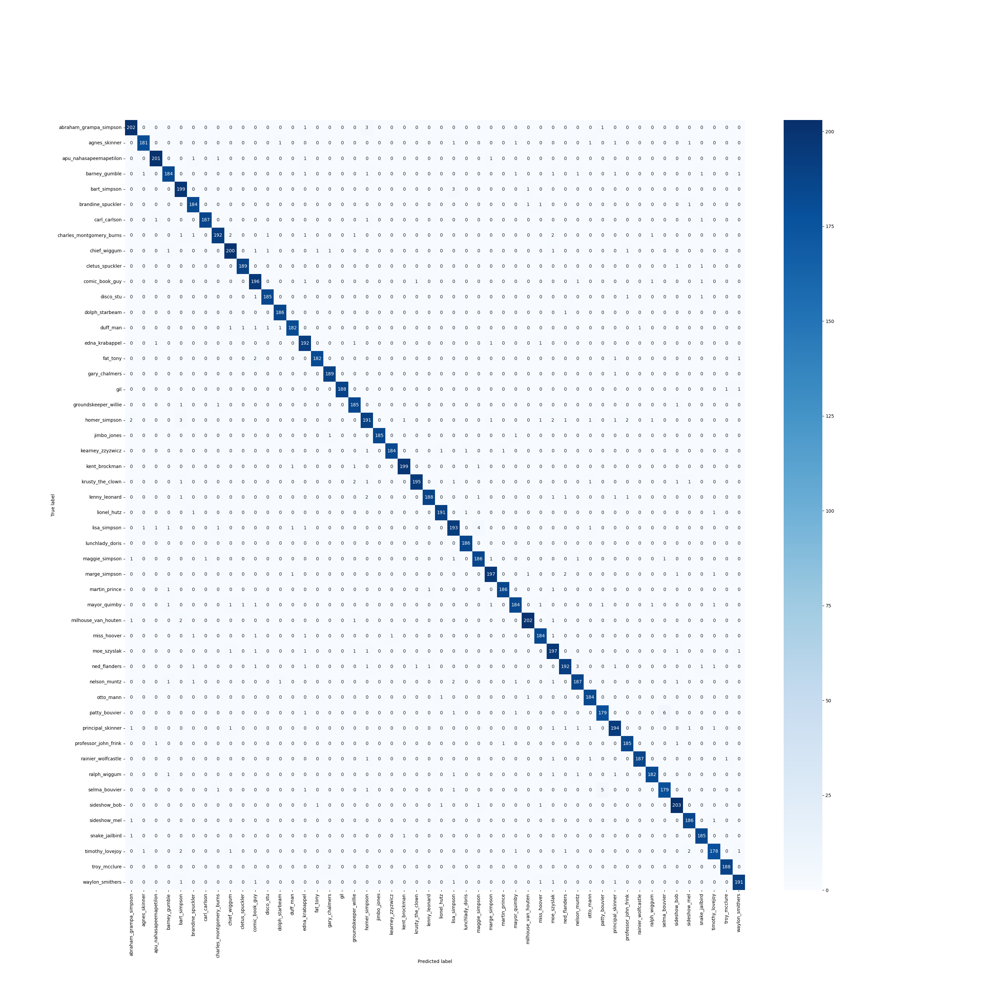
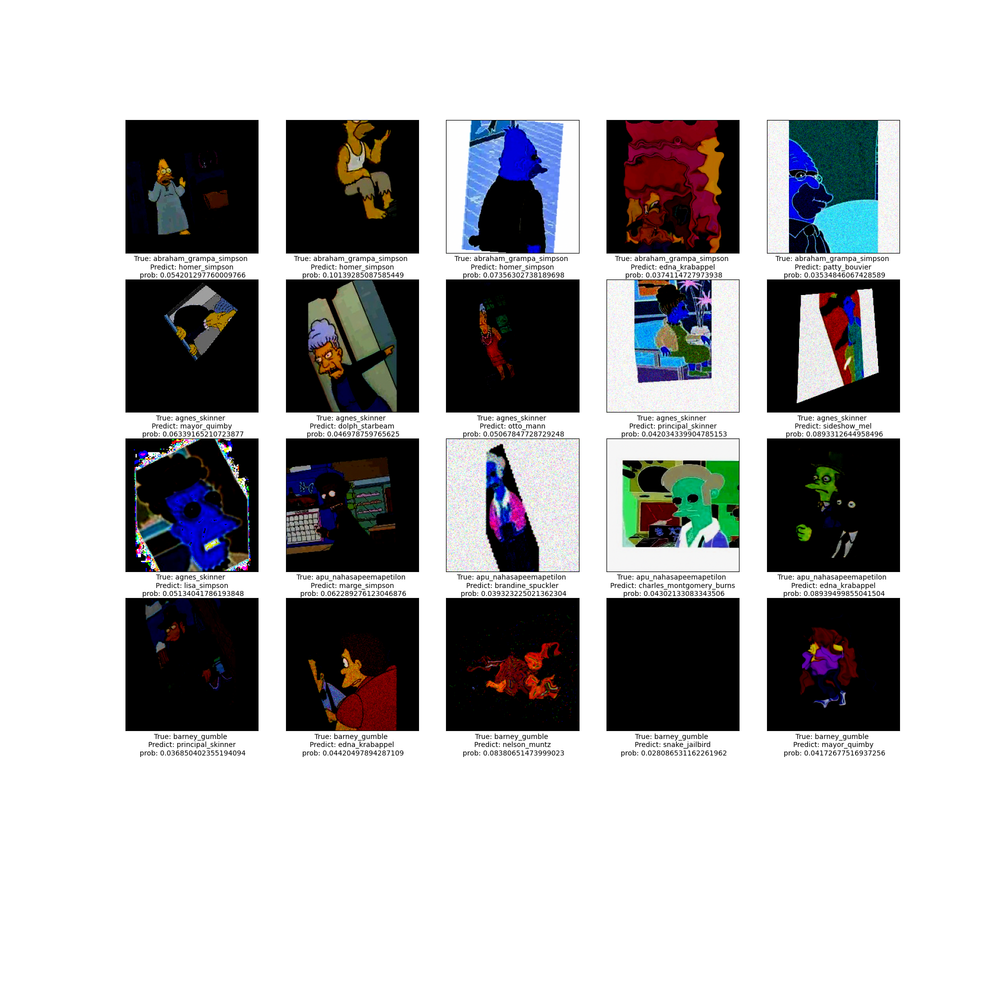

# the-simpsons-characters-recognition-challenge-iii-NYCU312707024

## 專案概述

本次作業主要透過使用Vision Transformer架構（ViT），並使用既有的模型在本次作業的資料及上進行fintuning，實現圖像分類任務。本次採用的模型是Google的`vit-base-patch16-224-in21k`，並利用`transformers`和`torchvision`庫中的工具進行圖像處理和數據加載。本作業包含一個訓練過程，用於對指定的數據集進行訓練，並評估模型性能。

## 安裝需求

Python 3.10.13

在運行本專案之前，需要安裝以下Python庫：

- torch
- torchvision
- transformers
- matplotlib
- PIL
- sklearn
- seaborn
- numpy
- split-folders

可以使用以下命令來嘗試安裝這些套件：
```bash
pip install -r requirment.txt
```
## 文件結構

- `data_proc.py`: 數據預處理腳本,用來將原始數據集分割成訓練集和驗證集
- `train.py`: 主腳本,用來加载數據,預處理,調參,訓練模型,以及生成提交文件
- `test.py`: 包含模型訓練和評估的函數
- `eval.py`: 用來生成提交文件
- `data/`: 數據集目錄,包含`train.csv`、`valid.csv` 和 `test.csv`

## data_proc.py 

`data_proc.py`是一個數據預處理腳本，用於將圖像數據集分割成訓練集和驗證集。此腳本使用`splitfolders`包來自動處理分割，並允許用戶自定義輸入路徑、輸出路徑及數據分割的比例。


### 使用說明

1. 確保已安裝`splitfolders`包，如果未安裝，可以使用以下命令安裝：

```sh
pip install split-folders
```
2. 從kaggle上下載資料，並確保提供的輸入路徑中包含了圖像數據，並且圖像是按類別分布在不同的文件夾中。
https://www.kaggle.com/competitions/machine-learning-2023nycu-classification

3. 使用命令行參數執行腳本：

```sh
python data_proc.py --input_dir ./path/to/your/images --output_dir ./path/to/output --split_ratio 0.9
```

### 參數說明

- `--input_dir`：原始圖像數據的路徑。預設為`./train/train`。
- `--output_dir`：分割後的數據儲存路徑。預設為`./data`。
- `--split_ratio`：訓練集在數據中占的比例。預設為`0.9`，即90%的數據將被用作訓練集，剩餘10%作為驗證集。

### 腳本輸出

運行腳本後，將會在控制台中打印出輸入路徑、輸出路徑和分割比例。數據分割完成後，會在指定的輸出路徑中生成對應的訓練集和驗證集文件夾。

### 注意事項

- 確保提供的輸入路徑中包含了圖像數據，並且圖像是按類別分布在不同的文件夾中。
- 分割過程可能需要一些時間，視乎數據集的大小而定。


## train.py 

### 參數

本腳本接受以下命令行參數：

- `--data_train_dir`：訓練資料集的路徑（預設為`../train/train`）。
- `--data_val_dir`：驗證資料集的路徑（預設為`../data/val`）。
- `--output_dir`：輸出文件夾的路徑（預設為`../output`）。
- `--batch_size`：批次大小（預設為15）。
- `--num_epochs`：訓練週期數（預設為5）。
- `--lr`：學習率（預設為2e-5）。
- `--weight_decay`：權重衰減（預設為0.005）。

### 數據預處理與增強

數據預處理和增強透過自定義的轉換`transform`來完成。這些轉換包括水平翻轉、隨機裁剪、色調調整、噪聲添加等操作。這些轉換能夠提高模型對於圖像變化的Robustness。

### 模型訓練

本專案使用`Trainer`類從預訓練的ViT模型開始訓練。訓練過程將按照指定的參數（如批次大小、學習率等）進行。模型在每個epoch結束時進行保存，並在驗證集上進行評估以選擇最佳模型。

### 評估

模型評估通過計算準確度來完成。這是通過`compute_metrics`函數實現，該函數接收模型預測和真實標籤，並計算預測的準確度。

### 使用方法

1. 確保所有依賴項都已安裝。
2. 根據需要調整命令行參數。
3. 運行腳本，開始訓練和評估。

例如：

```sh
python train.py --data_train_dir ./data/train --data_val_dir ./data/val --num_epochs 20 --batch_size 32
```

### 結果輸出

訓練結果和評估指標將會在控制台中輸出，同時最佳模型會根據指定的`--model_dir`儲存。

### 訓練結果
| Epoch | Training Loss | Validation Loss | Accuracy |
|-------|---------------|-----------------|----------|
| 1     | 0.344500      | 0.097723        | 0.986104 |
| 2     | 0.209100      | 0.035024        | 0.992280 |
| 3     | 0.159800      | 0.024537        | 0.994133 |
| 4     | 0.131200      | 0.020523        | 0.995677 |
| 5     | 0.123700      | 0.019905        | 0.995471 |

## eval.py

`eval.py` 是一個用於評估訓練好的 Vision Transformer (ViT) 模型的腳本。該腳本載入先前訓練的模型，並在給定的驗證數據集上進行性能評估。它還生成了混淆矩陣和錯誤分類圖像的視覺表示，以幫助用戶更好地理解模型的性能。

### 功能亮點

- **模型加載**: 從指定目錄加載預訓練的 ViT 模型。
- **性能評估**: 使用驗證集計算模型的準確度。
- **混淆矩陣**: 生成混淆矩陣，並以圖形形式呈現，幫助用戶識別哪些類別容易相互混淆。
- **錯誤分析**: 檢視和儲存預測錯誤的圖像，並顯示模型對於每個錯誤預測的置信度。
### 使用說明

在使用 `eval.py` 前，確保以下條件已被滿足：

1. 所有依賴的庫已經被安裝，包括 `torchvision`, `transformers`, `PIL`, `matplotlib`, `torch`, `sklearn`, `numpy` 和 `seaborn`。
2. 腳本所需的模型和數據集路徑正確無誤。
3. 運行腳本並檢視結果：

```sh
python eval.py --data_val_dir ./path/to/val --model_dir ./path/to/model
```

### 腳本參數

腳本接受以下命令行參數：

- `--data_train_dir`：訓練數據集的路徑（僅用於標籤映射）。
- `--data_val_dir`：驗證數據集的路徑。
- `--model_dir`：預訓練模型儲存的路徑。

### 性能評估結果
|      test_loss      |    test_accuracy   |
|:-------------------:|:------------------:|
| 0.12205814063549042 | 0.9755605842282338 |

### 混淆矩陣分析

腳本會產生一個混淆矩陣並儲存為 `confusion_matrix.png`。此圖表展示了模型預測和實際標籤之間的關係，每一行表示實際的類別，每一列表示模型的預測類別。矩陣的對角線表示正確預測的數量，而非對角線的元素則顯示錯誤預測的數量。此視覺工具對於理解模型在不同類別上的表現尤其有用。



我們可以看到混淆矩陣中的對角線元素都是非常大的，這意味著模型在大多數情況下都能正確預測圖像的類別。但是，我們還可以看到一些類別之間的混淆，例如 `homer_simpson` 和 `ned_flanders`，`marge_simpson` 和 `lisa_simpson`。這些類別之間的混淆可能是因為圖像中的人物特徵相似，例如 `homer_simpson` 和 `ned_flanders` 都有相似的鬍子，`marge_simpson` 和 `lisa_simpson` 都有相似的頭髮。這些混淆可能是由於圖像中的人物特徵相似。
也可能是因爲資料增強的關係，導致圖片的特徵相似，導致模型無法正確分類。

### 錯誤分析

除了混淆矩陣外，腳本還提供了一個錯誤分析視圖，它將前20張錯誤分類的圖像視覺化顯示出來，並標注了實際類別和錯誤預測的類別，包括模型對其預測的置信概率。這些圖像被儲存為 `wrong_img.png`。這對於評估模型對於特定實例的錯誤原因非常有幫助。

我們可以觀察到，通常模型對於錯誤預測的置信度都很低，這意味著模型對於這些圖像的預測都不是很確定。
尤其是在本次作業中有做了資料增強，導致圖片的特徵難以辨識，導致模型無法正確分類。
有些圖片特別過分，像是最右下角的倒數第二張圖片，圖片中只有一片黑，分得出來才怪。

## test.py

`test.py` 腳本是用來對 Vision Transformer (ViT) 模型進行測試的工具。它會加載一個已經訓練好的模型，處理測試數據集中的圖像，並產生一個提交文件，該文件包含每個測試圖像的預測類別。

### 功能亮點

- **模型加載**: 從指定的文件夾加載訓練好的 ViT 模型。
- **數據處理**: 對測試集中的圖像進行正確的轉換處理。
- **預測生成**: 對每個測試圖像進行類別預測。
- **結果輸出**: 生成適合提交的 CSV 文件，包含測試圖像的 ID 和預測類別。

### 生成提交文件

該腳本的主要輸出是一個 CSV 文件，其中包含了測試圖像的文件名（無副檔名）和對應的預測類別。該文件格式符合多數機器學習競賽的提交要求，可以直接用於評分和排名。

### 使用說明

在運行 `test.py` 腳本之前，請確保以下條件已滿足：

1. 所有必要的庫都已經安裝完畢。
2. 模型文件夾中有一個有效的訓練好的 ViT 模型。
3. 指定的測試數據集路徑包含要進行預測的圖像。

要運行此腳本，請使用以下命令：

```sh
python test.py --data_test_dir ./path/to/test --model_dir ./path/to/model --submission_name my_submission.csv
```

### 腳本參數

腳本接受以下命令行參數：
- `--data_test_dir`：測試數據集的路徑。
- `--submission_name`：輸出 CSV 文件的名稱。
- `--model_dir`：包含訓練好的模型的文件夾路徑。

### 結果
| Private Score | Public Score |     Rank    |
|:-------------:|:------------:|:-----------:|
|    0.98014    |    0.97806   | 10/71 (14%) |


## 心得
# 作業心得

透過這次的機器學習作業，我獲得了豐富而深刻的學習經驗，特別是在使用 Vision Transformer（ViT）進行圖像分類任務方面上做Trasfer Learning，這是一種相對於卷積神經網路（CNN）的新穎方法，它利用自注意力機制來處理圖像的全局信息。在這次的作業中，我們使用了 Google 的 `vit-base-patch16-224-in21k` 模型，並通過調整超參數和數據增強等方式來優化模型性能。最終，我們的模型在測試集上達到了 0.98014 的準確度，排名第 10 名。以下是我的學習心得、所掌握的新技術以及我認為的改進方向。

## 學習到的新技術

- **Vision Transformer (ViT)**: 了解並實際應用了 ViT 在圖像處理任務的能力。這是一種相對於卷積神經網路（CNN）的新穎方法，它利用自注意力機制來處理圖像的全局信息。
  
- **數據增強技術**: 學會如何通過添加高斯噪聲、雜訊點（salt-and-pepper）等方式進行圖像的數據增強，這有助於提高模型對於輸入變化的魯棒性。

- **PyTorch & Transformers**: 深入瞭解了 PyTorch 框架及 Hugging Face 的 Transformers 庫，這些工具對於模型的訓練和評估至關重要。

- **模型調優**: 學習到了如何調整模型的超參數，例如學習率（learning rate）、批次大小（batch size）和權重衰減（weight decay）來優化性能。

- **性能評估**: 掌握了如何使用混淆矩陣和準確率等指標來評估模型性能，並學會如何從錯誤分類中提取見解。

## 改進方向

- **模型輕量化**: ViT 模型相對較大，對計算資源有一定要求。未來可以探索模型壓縮和輕量化技術，以便於部署到計算資源有限的設備上。

- **超參數自動調整**: 目前的超參數調整相對手動和直觀，引入如 AutoML 工具能夠自動化這一過程，或許能達到更優的性能。

- **錯誤分析**: 雖然我們對於錯誤的分析已經有一定的視覺化呈現，但進一步探討錯誤的本質和模式，以及如何改進模型以避免這些錯誤，是很有必要的。

- **資料清洗**: 在數據預處理階段，更細緻的數據清洗可能會有助於模型性能的提升，例如去除異常值、不相關的背景信息等。

- **模型解釋性**: 目前的模型依然是個“黑盒子”，未來希望能夠嘗試結合一些解釋性模型解釋工具，以便更好地理解模型是如何做出決策的。
